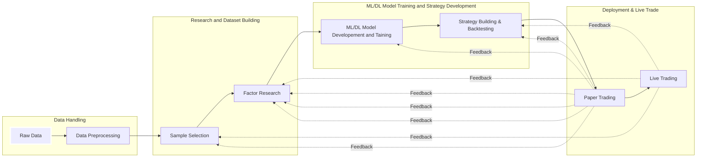

[](https://mybinder.org/v2/gh/skhan61/QuantProject.git/main)
# Deep Learning Statistical Arbitrage

## Overview: End-to-End ML/DL Based Trade Strategy Development

This project offers a comprehensive framework for the development and deployment of machine learning and deep learning models in trading strategies. Beginning with raw stock OHLCV data, the pipeline extends through data preprocessing, research, model training, and ultimately to live trading. The aim is to provide a full spectrum view of trading model development, inclusive of various skills and tools employed at different stages.

## Skills Demonstrated

### Data Preprocessing

The project commences with an efficient preprocessing of raw stock data, implemented in the notebook `01_raw_data_to_create_dataset.ipynb`. This stage is designed for handling large datasets, optimized to provide clean data for subsequent steps.

### Research and Dataset Building

Research-oriented notebooks focus on sample selection and factor research. They are covered in notebooks `02_sample_selection_and_returns_calculation.ipynb` and `03_common_alpha_factors.ipynb`. An additional notebook, `04_101_formulaic_alphas.ipynb`, explores a variety of alpha factors.

### ML/DL Model Development

Machine Learning and Deep Learning models are then trained and tested. Experiments are managed via MLflow for transparency and reproducibility. Relevant notebooks include `06_a_ML_models_forecasting.ipynb`, `06_b_DL_models_forecasting.ipynb`, and `06_c_DL_models_generative.ipynb`.

### Strategy Building and Backtesting

In the `07_strategy_building_and_backtesting.ipynb` notebook, a momentum-based trading strategy is devised employing traditional quantitative methods and modern portfolio optimization. The approach integrates machine learning predictions, dynamic portfolio rebalancing, and robust risk management techniques, including VaR computation and stop-loss mechanisms. This holistic strategy underscores the seamless fusion of ML insights with trading tactics.

### Operational Tools

The project is supported by a series of scripts and utilities. These range from dataset management (`top_stock_dataset_pipeline.py`) to MLflow experiment tracking (`top_mlflow_experiment.py`). Operational aspects are further enhanced by scripts for Git and Docker automation (`auto_commit.sh`, `push_to_dockerhub.sh`).

## Project Objective

The overarching objective is to offer a robust, end-to-end example of machine learning and deep learning in trading. It is intended to serve as a display of various skills: from data management and feature engineering to model development and deployment. These skills are supplemented by proficiency in various development tools, such as Git, Docker, and Bash, among others.

For further inquiries or potential collaborations, please contact me at sayem.eee.kuet@gmail.com.

## End to End ML/DL Trade Pipeline:



# Strategy Backtest Results

### Core Metrics:
| Metric               | SPY      | Strategy  |
|----------------------|----------|-----------|
| Risk-Free Rate       | 0.0%     | 0.0%      |
| Cumulative Return    | 9.05%    | 99.06%    |
| CAGR﹪               | 6.59%    | 66.07%    |
| Sharpe               | 0.49     | 1.57      |
| Sortino              | 0.73     | 2.65      |
| Max Drawdown         | -12.88%  | -20.19%   |
| Volatility (ann.)    | 15.6%    | 36.32%    |

### Performance:
| Metric               | SPY      | Strategy  |
|----------------------|----------|-----------|
| YTD                  | 19.09%   | 6.56%     |
| 1Y                   | 9.05%    | 99.06%    |
| 3Y (ann.)            | 6.59%    | 66.07%    |

### Risk Metrics:
| Metric               | SPY      | Strategy  |
|----------------------|----------|-----------|
| Max Consecutive Losses | 5      | 4         |
| Daily Value-at-Risk  | -1.59%   | -3.54%    |
| Expected Shortfall (cVaR) | -1.59% | -3.54% |

### EOY Returns vs Benchmark:
| Year                 | SPY      | Strategy  | Multiplier | Won  |
|----------------------|----------|-----------|------------|------|
| 2022                 | -8.43    | 86.80     | -10.30     | +    |
| 2023                 | 19.09    | 6.56      | 0.34       | -    |

### Worst 3 Drawdowns:
| Started              | Recovered | Drawdown  | Days       |
|----------------------|-----------|-----------|------------|
| 2023-06-27           | 2023-08-03| -20.19    | 38         |
| 2023-05-15           | 2023-06-22| -13.26    | 39         |
| 2022-11-11           | 2022-11-29| -10.24    | 19         |

# Project Workflow and Notebooks

This document outlines the various stages of the project pipeline along with the corresponding Jupyter notebooks that provide detailed steps for each stage.

---

## Table of Contents
1. [Data Handling](#data-handling)
2. [Research and Dataset Building](#research-and-dataset-building)
3. [ML/DL Model Training and Strategy Development](#mldl-model-training-and-strategy-development)
4. [Deployment & Live Trade](#deployment--live-trade)

---

## Data Handling
- [01_raw_data_to_create_dataset.ipynb](01_raw_data_to_create_dataset.ipynb)  
  **Description**: Transforming raw data into a cohesive dataset structure.

---

## Research and Dataset Building
- [02_sample_selection_and_returns_calculation.ipynb](02_sample_selection_and_returns_calculation.ipynb)  
  **Description**: Insights and techniques for optimal data sample selection and calculating returns.
  
- [03_common_alpha_factors.ipynb](03_common_alpha_factors.ipynb)  
  **Description**: An exploration into the prevalent alpha factors in finance.
  
- [04_101_formulaic_alphas.ipynb](04_101_formulaic_alphas.ipynb)  
  **Description**: Constructing alphas from predefined formulae.
- [05_a_dataset_building.ipynb](05_a_dataset_building.ipynb)  
  **Description**: Streamlining the dataset for machine learning applications.
- [05_b_ic_based_feature_selection.ipynb](05_b_ic_based_feature_selection.ipynb)  
  **Description**: Harnessing the Information Coefficient (IC) for effective feature selection.
---

## ML/DL Model Training and Strategy Development

- [06_a_ML_models_forecasting.ipynb](06_a_ML_models_forecasting.ipynb)  
  **Description**: Diving into machine learning models for precise forecasting.

- [06_b_DL_models_forecasting.ipynb](06_b_DL_models_forecasting.ipynb)  
  **Description**: A deep dive into the world of deep learning forecasting models.
  
- [06_c_DL_models_generative.ipynb](06_c_DL_models_generative.ipynb)  
  **Description**: Leveraging deep learning for generative model constructs.

- [07_strategy_building_and_backtesting.ipynb](07_strategy_building_and_backtesting.ipynb)  
  **Description**: Constructing and assessing the trading strategy.

---

## Strategy Results

### Additional Resources

- [formulaic_alphas.py](formulaic_alphas.py): An array of formulae dedicated to alpha derivation.

- [notebook_05.py](notebook_05.py), [notebook_06.py](notebook_06.py): Scripts complementing specific notebooks.

- [top_mlflow_experiment.py](top_mlflow_experiment.py): Script for MLflow experiment tracking.

- [top_stock_dataset_pipeline.py](top_stock_dataset_pipeline.py): Scripted pipeline for stock dataset management.

- [utils.py](utils.py): A collection of utility functions and procedures for project-wide use.

- [auto_commit.sh](auto_commit.sh), [push_to_dockerhub.sh](push_to_dockerhub.sh): Automation scripts enhancing repository management.

### Old (Archived)

This section houses deprecated versions or previously used files, preserved for reference.

## Repository Configuration

For seamless integration and collaboration, our repository adheres to certain `.gitignore` rules:

```plaintext

# Default rule - ignore all files

*

# Exclude credential files and output notebooks

*_creds.txt

./output_notebook/**

  

# Explicitly allow only .py, .ipynb, and a few other specified files/folders

!*.py

!*.ipynb

!.gitignore

!*.sh

!./Old/

!./Old/**

!.yml

```
